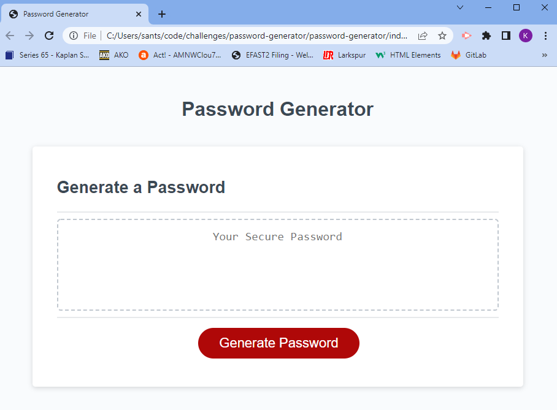

# Password Generator Challenge

## Overview
The challenge for this module was to create a random password generator using javascript. The acceptance criteria requires multiple prompts to build a database of acceptable characters with which the random password will be built.  

## Project Description
This project includes the following Acceptance Criteria:

GIVEN I need a new, secure password

WHEN I click the button to generate a password
THEN I am presented with a series of prompts for password criteria

WHEN prompted for password criteria
THEN I select which criteria to include in the password

WHEN prompted for the length of the password
THEN I choose a length of at least 8 characters and no more than 128 characters

WHEN asked for character types to include in the password
THEN I confirm whether or not to include lowercase, uppercase, numeric, and/or special characters

WHEN I answer each prompt
THEN my input should be validated and at least one character type should be selected

WHEN all prompts are answered
THEN a password is generated that matches the selected criteria

WHEN the password is generated
THEN the password is either displayed in an alert or written to the page

## Run and Install

The deployed random password generator can be accessed [here](https://kristensantee.github.io/password-generator/). A screenshot of the site is shown below: 

## How to Use the Project

This application generates a prompt window and a series of confirm windows on the click event when the user clicks "Generate Password." The first prompt requests a length to be determined by the user which is limited to between 8 and 128 characters. If the user chooses a non-number character or a number outside the acceptable length criteria, an alert will notify the user to choose a number between 8 and 128. Once an acceptable length is determined, a series of confirm popup windows will ask the user for additional character pools to pull from. For example, if the user would like to include special characters, capital letters, numbers, or lowercase letters. The user can choose any or any combination of the character pools from which to generate the password, however, there is no underlying requirement for each selected pool to be represented in the final password. Once the available character pool is created, a for loop executes a random function to create a passwordthat terminates at the specified length.

## How to Contribute to the Project

This project was created as an introduction to javascript and is open to review and collaboration to improve and simplify the code. The html and css files were provided through course instruction as the javascript was largely the assignment for this project.

